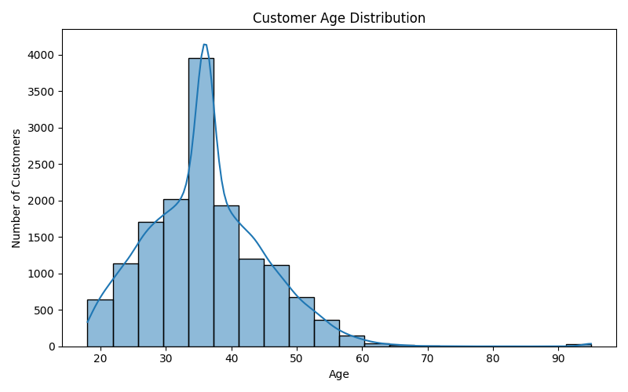
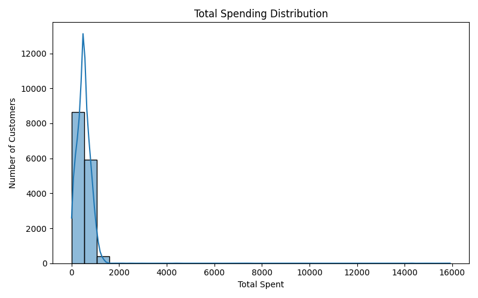
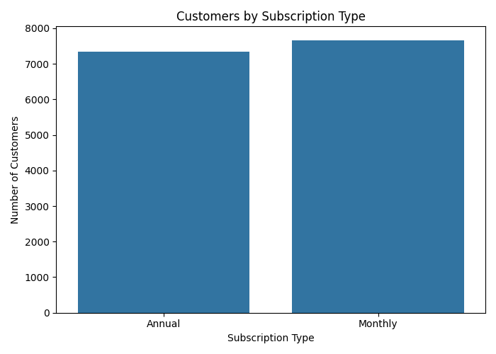
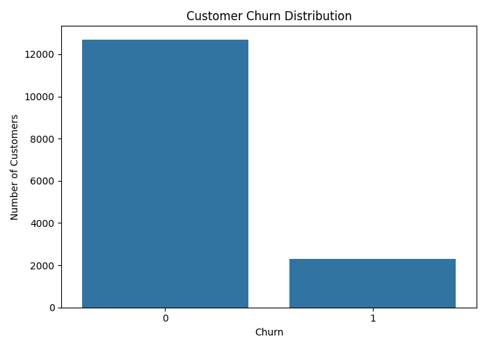
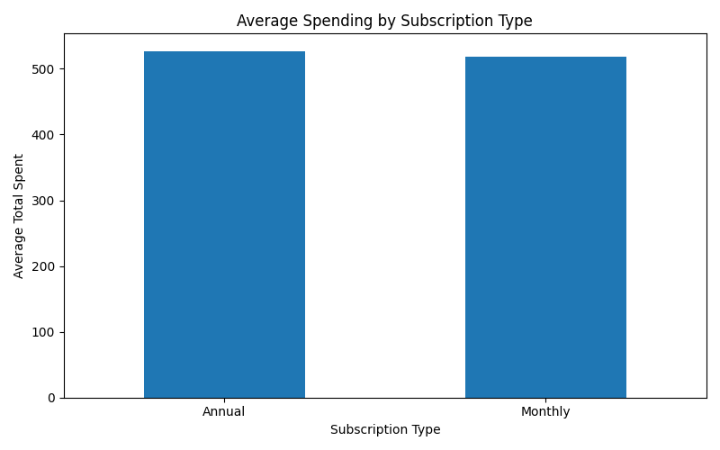
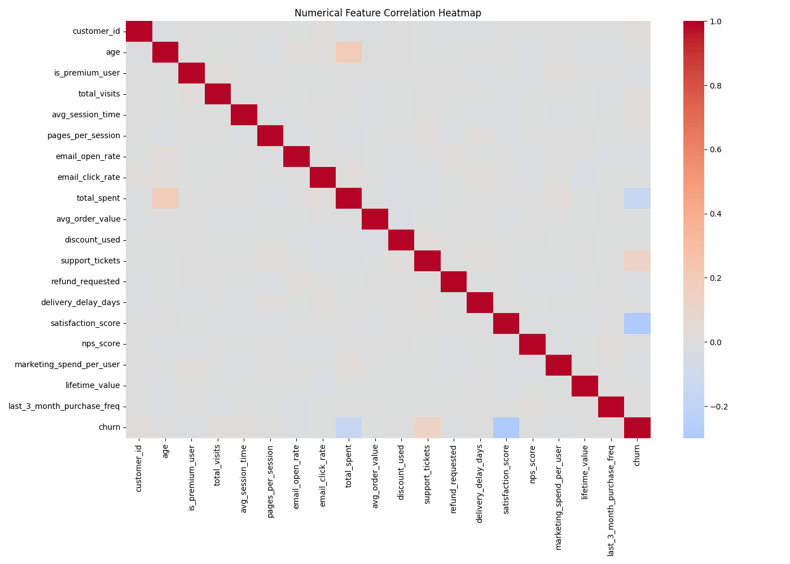

# Automated Dataset Cleaning & Analytics Pipeline

## Week 1 — Machine Learning Engineering Track

An automated Python pipeline for cleaning, validating, and analyzing a noisy customer Sales & Marketing dataset using Pandas and NumPy.

## Project Objective

The pipeline automatically performs:

- Missing-value detection and imputation
- String and column-name sanitization
- Data-type correction
- Invalid-value handling
- Duplicate detection and removal
- Statistical profiling
- Categorical and groupby analysis
- EDA visualization generation

## Dataset

| Property | Value |
|---|---:|
| Records | 15,000 |
| Features | 30 |
| Domain | Customer Sales & Marketing |
| Format | CSV |

## Data Transformation Logic

### Missing Values

| Column | Missing Values | Strategy |
|---|---:|---|
| gender | 738 | Mode |
| age | 1,200 | Median |
| total_spent | 1,050 | Median |
| satisfaction_score | 702 | Median |
| coupon_code | 6,133 | `NO_COUPON` |

### Invalid Values

Customer ages outside the valid range of **18–100** are treated as invalid, converted to missing values, and subsequently imputed using the median.

### String & Structural Cleaning

- Leading/trailing whitespace is removed.
- Empty strings are converted to missing values.
- Column names are converted to lowercase snake_case.
- Date columns are converted to datetime.
- Duplicate records are automatically detected and removed.

## Before vs After Cleaning

| Metric | Before | After |
|---|---:|---:|
| Rows | 15,000 | 15,000 |
| Columns | 30 | 30 |
| Missing Values | 9,823 | 0 |
| Duplicate Rows | 0 | 0 |

**Result:** All 15,000 records were retained without arbitrary deletion.

## EDA & Analytics

The pipeline generates:

- Numerical statistical summaries
- Categorical frequency distributions
- Groupby analysis
- Customer age distribution
- Total spending distribution
- Subscription distribution
- Churn distribution
- Average spending by subscription
- Numerical feature correlation heatmap

### Key Groupby Results

**Average spending by subscription:**

| Subscription | Average Spending |
|---|---:|
| Annual | 527.16 |
| Monthly | 518.19 |

**Average lifetime value by acquisition channel:**

| Channel | Average Lifetime Value |
|---|---:|
| Referral | 1249.41 |
| Email | 1242.45 |
| Facebook Ads | 1236.67 |
| Organic | 1232.29 |
| Google Ads | 1218.41 |

## EDA Charts

### Age Distribution



### Total Spending Distribution



### Subscription Distribution



### Churn Distribution



### Average Spending by Subscription



### Correlation Heatmap



## Project Structure

```text
automated-dataset-cleaning-pipeline/
│
├── data/
│   ├── raw/
│   └── processed/
│
├── outputs/
│   ├── figures/
│   └── reports/
│
├── src/
│   ├── cleaning.py
│   ├── eda.py
│   ├── inspect_data.py
│   └── main.py
│
├── notebooks/
├── requirements.txt
├── .gitignore
└── README.md
Technologies
Python 3.10
Pandas
NumPy
Matplotlib
Seaborn
Google Colab
Git & GitHub
Execution

Run the complete pipeline with:

python src/main.py

The pipeline outputs:

Cleaned dataset → data/processed/cleaned_dataset.csv
Cleaning reports → outputs/reports/
EDA charts → outputs/figures/
Google Colab

The complete pipeline has been successfully executed in Google Colab.

**Colab:** [Open the Google Colab Notebook] (https://colab.research.google.com/drive/1_cW4jUL6dW0oWaqSygQw30aIcXuXkry3?usp=sharing  )

Conclusion

The pipeline successfully transformed the 15,000-row dataset by reducing missing values from 9,823 to 0, handling invalid values, preserving all records, and generating statistical, categorical, grouped, and visual analytics.